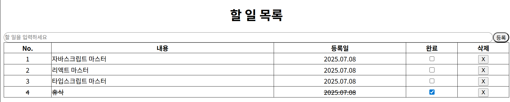

# 리액트 투두 앱 만들기 미션 레포

## ✔️ 주요 기능

1. 할 일 추가
2. 할 일 삭제
3. 완료 체크
4. `localStorage` 저장 및 동기화

---

## 🗂️ 프로젝트 구조

```
src
├─ components/
|  ├─ Header.tsx
│  ├─ TodoItem.tsx
│  ├─ TodoList.tsx
│  └─ TodoWriteForm.tsx
├─ hooks/
│  └─ useTodos.ts
├─ main.jsx
├─ App.jsx
├─ index.css
└─ util/
   └─ storage.ts
```

---

## 💻 화면 스크린샷


